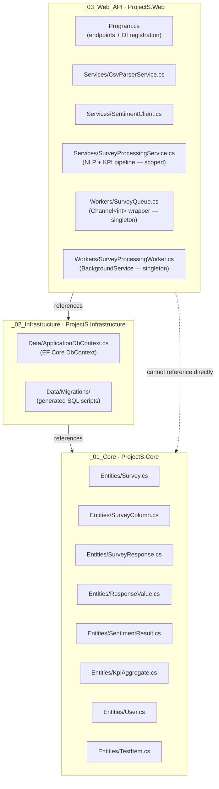
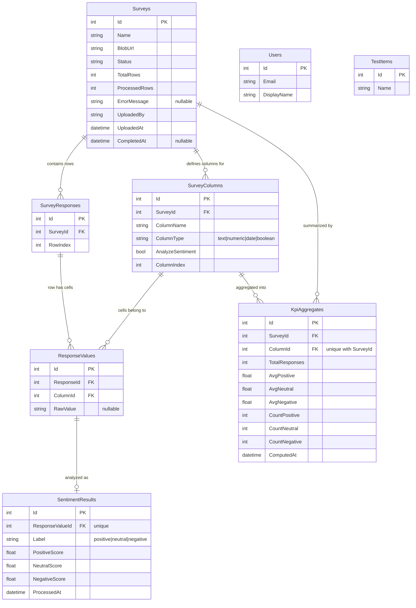
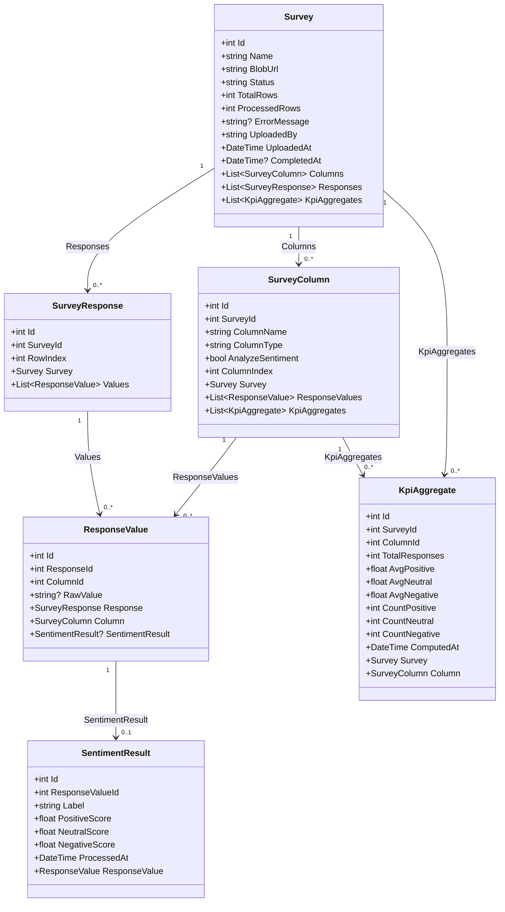
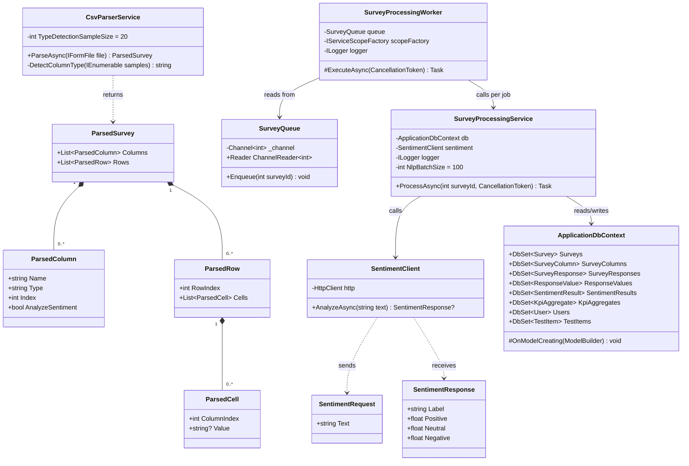
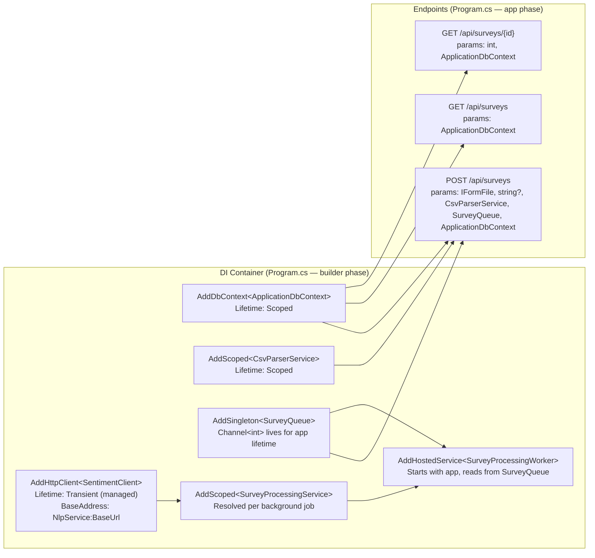
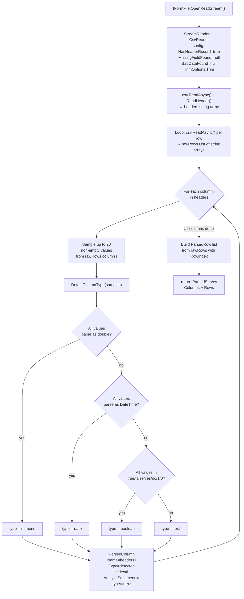
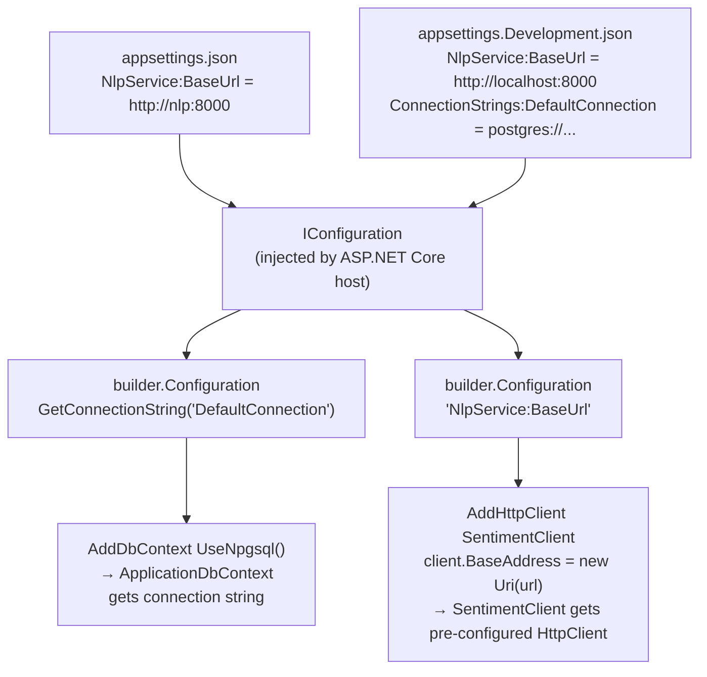

# How It All Connects — Backend Architecture

This document is a code-level reference for how every piece of the backend
fits together. Read it alongside the source files — each section tells you
what file to open and what to look for.

---

## 1. Three-Layer Architecture

The backend is split into three C# projects. Each layer can only reference
the layer below it — never above.



**Rule:** `Web API` knows about `Infrastructure` and (transitively) `Core`.
`Infrastructure` knows about `Core`. `Core` knows about nothing — it has zero
framework dependencies. This keeps entities portable and independently testable.

| Layer | Project file | Namespace | Contains |
|---|---|---|---|
| Core | `_01_Core.csproj` | `ProjectS.Core` | Entity classes only. Pure C#, no EF, no ASP.NET. |
| Infrastructure | `_02_Infrastructure.csproj` | `ProjectS.Infrastructure` | `ApplicationDbContext`, EF Core config, migrations. |
| Web API | `_03_Web_API.csproj` | `ProjectS.Web` | `Program.cs` (endpoints), `CsvParserService`, `SentimentClient`, `SurveyProcessingService`, `SurveyQueue`, `SurveyProcessingWorker`. |

---

## 2. Database Schema

### 2a. ER Diagram

Every table in the database, their columns, and their relationships.
Foreign keys are shown with the crow's-foot notation (one-to-many, one-to-one).



### 2b. Indexes

| Table | Index | Type | Purpose |
|---|---|---|---|
| `Surveys` | `Status` | Non-unique | Filter by status (queued/processing/complete) |
| `Surveys` | `UploadedBy` | Non-unique | Future: per-user survey filtering |
| `SurveyResponses` | `(SurveyId, RowIndex)` | Non-unique composite | Ordered row retrieval per survey |
| `ResponseValues` | `ColumnId` | Non-unique | Load all values for a column |
| `SentimentResults` | `ResponseValueId` | **Unique** | Enforces one-to-one with ResponseValue |
| `KpiAggregates` | `(SurveyId, ColumnId)` | **Unique composite** | Enforces one aggregate per survey×column |

### 2c. Cascade vs Restrict Delete

Configured in `ApplicationDbContext.OnModelCreating()`:

| FK | Behavior | Why |
|---|---|---|
| `SurveyColumn.SurveyId` | Cascade | Columns have no meaning without their survey |
| `SurveyResponse.SurveyId` | Cascade | Responses have no meaning without their survey |
| `ResponseValue.ResponseId` | Cascade | Cell dies with its row |
| `ResponseValue.ColumnId` | **Restrict** | Prevent silently orphaning cells if a column is deleted |
| `SentimentResult.ResponseValueId` | Cascade | Result dies with its cell |
| `KpiAggregate.ColumnId` | **Restrict** | Aggregates should be explicitly cleared, not auto-deleted |

---

## 3. Entity Class Diagram

The entity classes live in `_01_Core/Entities/`. Their navigation properties
are what EF Core uses to join tables — they are never set manually by application
code for FK resolution.



---

## 4. Service Class Diagram

Services live in `_03_Web_API/Services/` and `_03_Web_API/Workers/`.



---

## 5. Dependency Injection Wiring

All service registration happens in `Program.cs` during the **builder phase**
(before `builder.Build()` is called).



**Config resolution for `SentimentClient.BaseAddress`:**

```
appsettings.Development.json  →  NlpService:BaseUrl  →  http://localhost:8000  (local dev)
appsettings.json              →  NlpService:BaseUrl  →  http://nlp:8000        (Docker)
```

`"nlp"` is the docker-compose service name — Docker's internal DNS resolves it
to the container's IP automatically.

---

## 6. Request Lifecycle — POST /api/surveys (Async, Step 6+)

The endpoint now returns `202 Accepted` immediately after persisting CSV rows.
NLP + KPI computation runs in the background via `SurveyProcessingWorker`.

```mermaid
sequenceDiagram
    participant Client
    participant EP   as Program.cs\nPOST /api/surveys
    participant CSV  as CsvParserService\n.ParseAsync()
    participant DB   as ApplicationDbContext\n(PostgreSQL)
    participant Q    as SurveyQueue\nChannel&lt;int&gt;
    participant W    as SurveyProcessingWorker\n(BackgroundService)
    participant SPS  as SurveyProcessingService\n.ProcessAsync()
    participant SC   as SentimentClient\n.AnalyzeAsync()
    participant NLP  as Python FastAPI\nPOST /analyze

    Client->>EP: multipart/form-data (file, name?)

    Note over EP: Phase 1 — Validate
    EP->>EP: Check file != null, .csv extension

    Note over EP,CSV: Phase 2 — Parse CSV
    EP->>CSV: ParseAsync(IFormFile)
    CSV->>CSV: Read headers + rows, detect column types
    CSV-->>EP: ParsedSurvey { Columns[], Rows[] }

    Note over EP,DB: Phase 3 — Save Survey (status=queued)
    EP->>DB: INSERT Survey (status="queued")
    DB-->>EP: survey.Id assigned

    Note over EP,DB: Phase 4 — Save column definitions
    EP->>DB: INSERT SurveyColumn[] (one per header)
    DB-->>EP: columnEntities[] with Ids assigned

    Note over EP,DB: Phase 5 — Save rows + cells (batches of 500)
    loop Every 500 parsed rows
        EP->>EP: Build SurveyResponse + ResponseValue[]\nvia EF Core navigation properties
        EP->>DB: INSERT SurveyResponses + ResponseValues
    end

    Note over EP,Q: Phase 6 — Enqueue and return immediately
    EP->>Q: queue.Enqueue(survey.Id)
    EP-->>Client: 202 Accepted\n{ id, name, status="queued", totalRows, columnCount }

    Note over W,SPS: Background — Worker picks up survey ID
    W->>Q: ReadAllAsync() — dequeues survey.Id
    W->>W: scopeFactory.CreateScope()
    W->>SPS: ProcessAsync(surveyId, ct)

    SPS->>DB: UPDATE Survey status="processing"

    Note over SPS,NLP: Background Phase A — Sentiment analysis
    SPS->>DB: SELECT ResponseValues WHERE ColumnId IN text columns
    DB-->>SPS: textValues[]

    loop Every 100 text ResponseValues
        SPS->>SC: AnalyzeAsync(rv.RawValue)
        SC->>NLP: POST /analyze { "text": "..." }
        NLP-->>SC: { label, positive, neutral, negative }
        SC-->>SPS: SentimentResponse (or null on failure)
        SPS->>DB: INSERT SentimentResults batch
    end

    Note over SPS,DB: Background Phase B — KPI aggregates
    loop Per text column
        SPS->>DB: SELECT SentimentResults WHERE ColumnId = x
        SPS->>DB: INSERT KpiAggregate (avg + counts)
    end

    SPS->>DB: UPDATE Survey status="complete", processedRows, completedAt
```

**Polling:** Angular calls `GET /api/surveys/{id}` every 2s while
`status` is `queued` or `processing`. The status badge and processing
banner update live. Polling stops when status reaches `complete` or `error`.

---

## 7. CsvParserService — Parse Pipeline

`CsvParserService.ParseAsync()` in `_03_Web_API/Services/CsvParserService.cs`
runs in two sequential phases: **Read** then **Detect**.



**Type detection priority matters:** `"1"` and `"0"` are valid as both numeric
and boolean. Checking numeric first means a column of 1s and 0s becomes
`numeric`, not `boolean`. Only a column containing exclusively `true/false/yes/no/1/0`
with no other numeric values becomes `boolean`.

---

## 8. EF Core Navigation Property Pattern

This is how `Program.cs` saves ResponseValues without manually setting FK values.

In Phase 5 of the upload, instead of this (manual FK):
```csharp
// ❌ Manual — error-prone, requires knowing responseId before save
var rv = new ResponseValue { ResponseId = response.Id, ColumnId = col.Id };
```

The code does this (navigation property):
```csharp
// ✅ Navigation property — EF Core resolves the FK automatically on SaveChangesAsync()
response.Values = row.Cells.Select(cell => new ResponseValue {
    ColumnId = columnEntities[cell.ColumnIndex].Id,
    RawValue = cell.Value,
}).ToList();
```

EF Core sees that `response.Values` contains ResponseValue objects linked to
a tracked `response` entity. On `SaveChangesAsync()` it:
1. Inserts the `SurveyResponse` row first to get its `Id`
2. Sets `ResponseValue.ResponseId = response.Id` for every child
3. Inserts all `ResponseValue` rows in a single round trip

---

## 9. NLP Service Architecture

The Python service lives in `nlp/`. It is a separate process — the ASP.NET
Core API communicates with it over HTTP only.

```mermaid
graph TD
    subgraph Startup["FastAPI Lifespan — app/main.py"]
        L1["@asynccontextmanager lifespan(app)"]
        L2["load_model() called once\n→ model.py: _pipeline = pipeline(...)"]
        L3["Model weights loaded into RAM\n~700MB, ~2-5s startup time"]
        L4["yield — app is now serving"]
    end

    subgraph Request["Per-request — POST /analyze"]
        R1["AnalyzeRequest { text: str }"]
        R2["Validate: text.strip() != empty"]
        R3["run_sentiment(text)\n→ model.py: analyze(text)"]
        R4["_pipeline(text)\n→ cardiffnlp/twitter-roberta-base-sentiment-latest"]
        R5["results = List of label+score dicts\ne.g. negative:0.01, neutral:0.02, positive:0.97"]
        R6["scores = { label.lower(): score }"]
        R7["label = max(scores, key=lambda k: scores[k])"]
        R8["return { label, positive, neutral, negative }"]
    end

    L1 --> L2 --> L3 --> L4
    R1 --> R2 --> R3 --> R4 --> R5 --> R6 --> R7 --> R8
```



**Model loading is intentionally global.** `_pipeline` is a module-level
variable in `app/model.py` set once by `load_model()`. Every request calls
`analyze()` which uses the already-loaded `_pipeline`. If model loading were
per-request, startup would take 2–5 seconds per call.

**`return_all_scores=True`** on the pipeline call is required. Without it,
the model only returns the single highest-scoring label. We need all three
scores to store `PositiveScore`, `NeutralScore`, and `NegativeScore` in the
`SentimentResult` row.

---

## 10. Full Data Path — One CSV Cell to KpiAggregate

Trace a single free-text cell (e.g. `"Great product!"` in column `"Feedback"`,
row 0) from the moment the file is uploaded to the moment it contributes to
a `KpiAggregate` row.

```mermaid
flowchart LR
    A["IFormFile\n.csv bytes"] -->|ParseAsync| B["ParsedCell\nColumnIndex=2\nValue='Great product!'"]
    B -->|Build entity| C["ResponseValue\nId=101\nColumnId=5\nRawValue='Great product!'"]
    C -->|SaveChangesAsync| D["DB: response_values\nrow Id=101"]
    D -->|SELECT WHERE ColumnId=5| E["SentimentClient\n.AnalyzeAsync('Great product!')"]
    E -->|POST /analyze| F["Python pipeline\n→ positive:0.96\nneutral:0.03\nnegative:0.01"]
    F -->|SentimentResponse| G["SentimentResult\nResponseValueId=101\nLabel='positive'\nPositiveScore=0.96"]
    G -->|SaveChangesAsync| H["DB: sentiment_results\nrow Id=55"]
    H -->|AVG + COUNT\nper ColumnId=5| I["KpiAggregate\nSurveyId=1, ColumnId=5\nAvgPositive=0.83\nCountPositive=42\nTotalResponses=50"]
    I -->|SaveChangesAsync| J["DB: kpi_aggregates\nrow Id=3"]
    J -->|Dashboard reads| K["GET /api/surveys/1\n→ columns with\nanalyzeSentiment=true"]
```



**Key IDs to follow when debugging:**

| Step | Table | FK chain |
|---|---|---|
| ResponseValue created | `response_values` | `ColumnId → SurveyColumns.Id` |
| SentimentResult created | `sentiment_results` | `ResponseValueId → response_values.Id` |
| KpiAggregate written | `kpi_aggregates` | `ColumnId → SurveyColumns.Id`, `SurveyId → Surveys.Id` |

To verify a complete pipeline run in `psql`:
```sql
-- Check one ResponseValue and its SentimentResult
SELECT rv.id, rv.raw_value, sr.label, sr.positive_score
FROM "ResponseValues" rv
JOIN "SentimentResults" sr ON sr.response_value_id = rv.id
WHERE rv.column_id = 5
LIMIT 5;

-- Check the KpiAggregate for that column
SELECT * FROM "KpiAggregates" WHERE column_id = 5;
```

---

## 11. Configuration Flow

How settings reach each service at runtime:



`appsettings.Development.json` values **override** `appsettings.json` values
when `ASPNETCORE_ENVIRONMENT=Development` (the default when running `dotnet run`
locally). In Docker the environment defaults to `Production`, so only
`appsettings.json` applies — that's why the Docker URL (`http://nlp:8000`) lives
in the base file.
