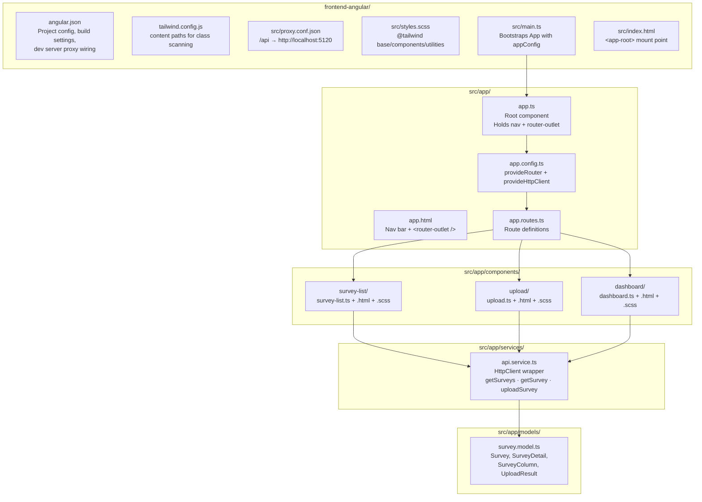
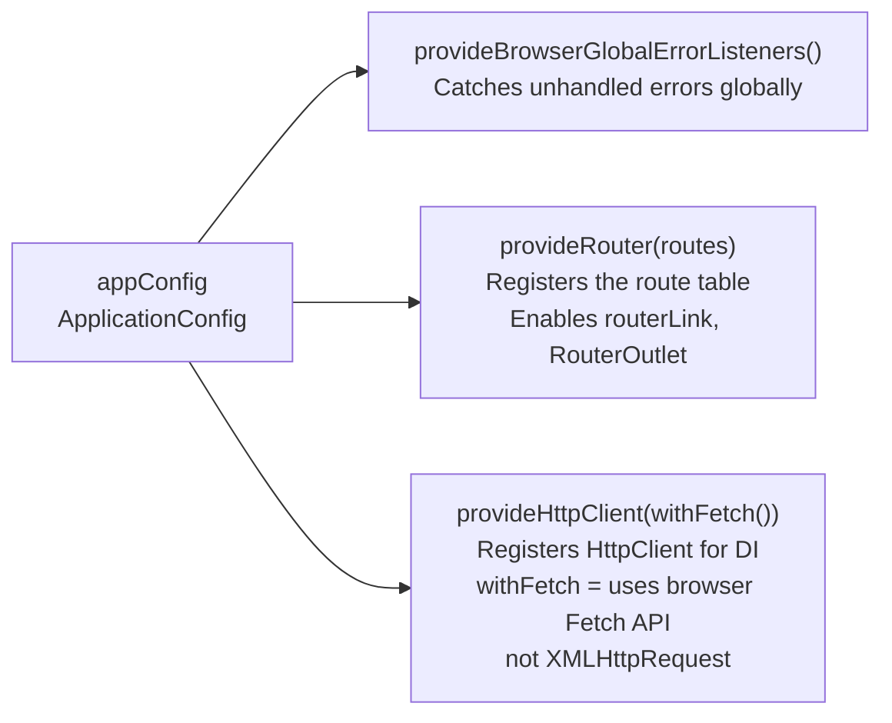
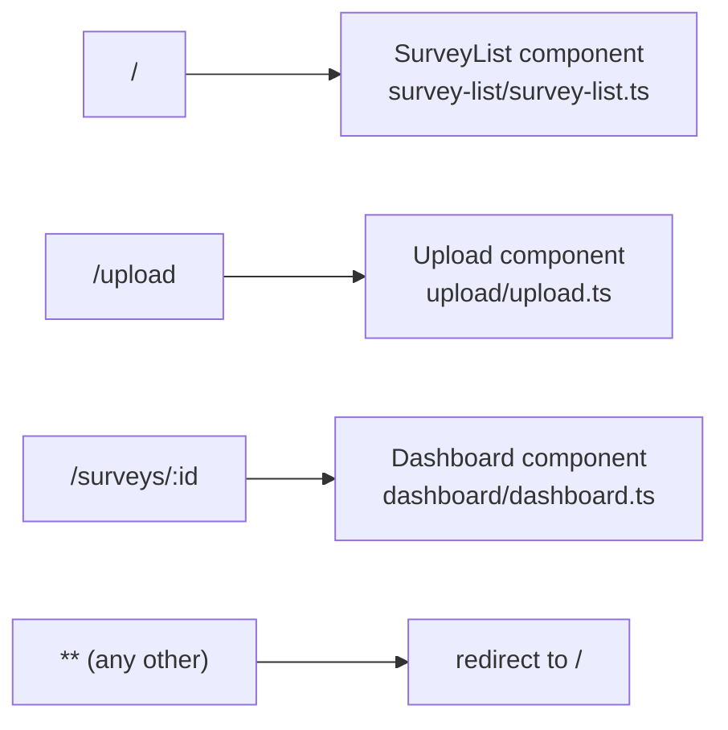
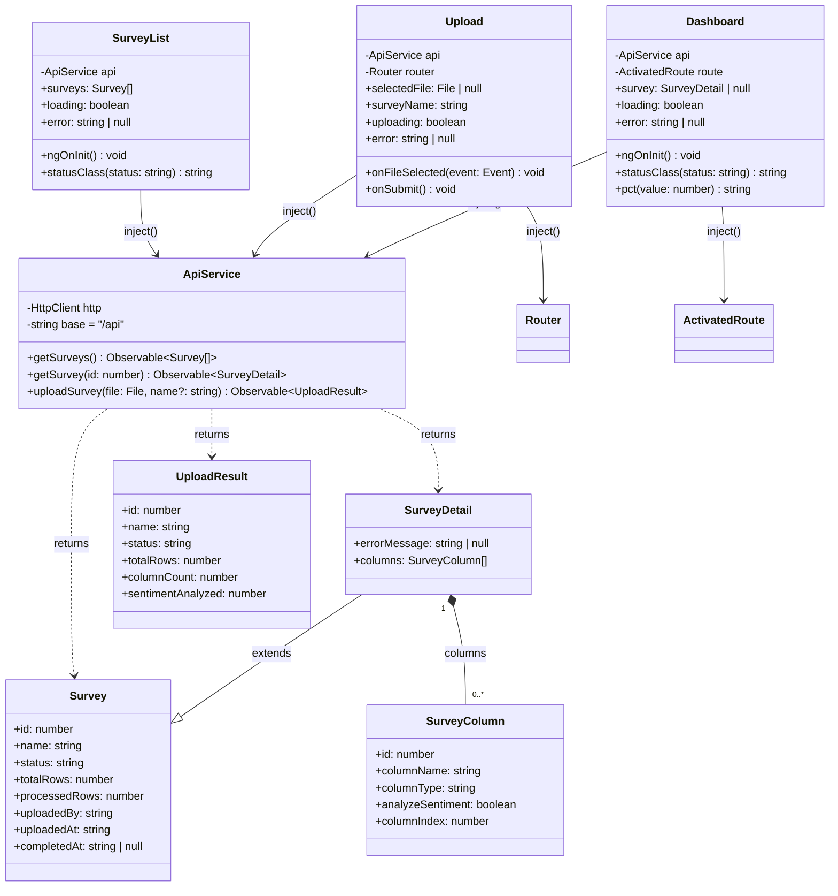
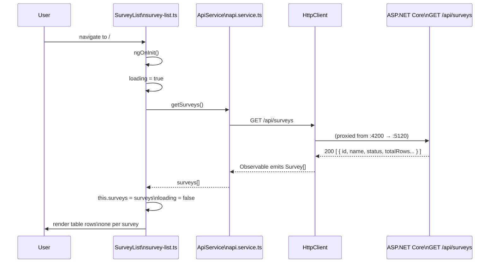
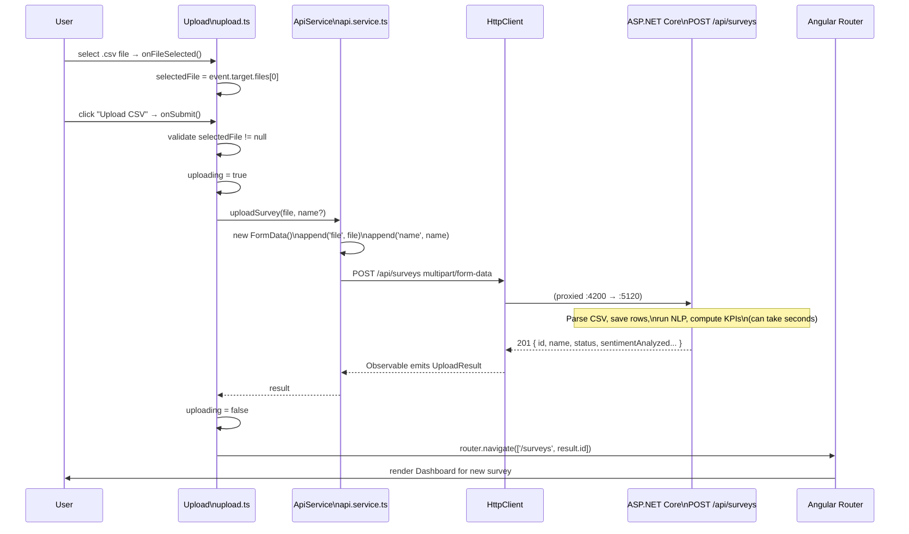
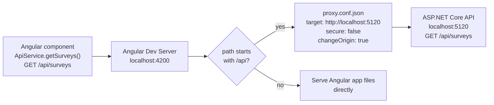

# How It All Connects — Angular Frontend Architecture

This document covers the Angular frontend in `frontend-angular/`. Read it
alongside the source files — each section points to the exact file and what
to look for.

---

## 1. Project Structure



---

## 2. Bootstrap Chain

How Angular starts from a single entry point to a rendered page:

```mermaid
sequenceDiagram
    participant Browser
    participant Main   as src/main.ts
    participant Config as app.config.ts
    participant App    as app.ts (App component)
    participant Router as Angular Router
    participant Outlet as &lt;router-outlet&gt;

    Browser->>Main: load index.html → main.ts
    Main->>Config: bootstrapApplication(App, appConfig)
    Config->>Config: provideRouter(routes) — registers route table
    Config->>Config: provideHttpClient(withFetch()) — registers HttpClient
    Config-->>Main: ApplicationRef created
    Main->>App: render &lt;app-root&gt; → app.html
    App->>Router: &lt;router-outlet /&gt; activates router
    Router->>Router: match current URL to routes[]
    Router->>Outlet: render matched component into outlet
```

**`src/main.ts`** calls `bootstrapApplication(App, appConfig)` — this is Angular's
standalone bootstrap. There is no `AppModule`. All providers are declared in
`app.config.ts` and passed directly.

---

## 3. Application Configuration (`app.config.ts`)



`provideHttpClient` must be here — without it, injecting `HttpClient` in
`ApiService` throws a runtime error. `withFetch()` is the modern default
for Angular 17+ and is required for SSR compatibility.

---

## 4. Routing



Routes are defined in `app.routes.ts` and passed to `provideRouter()`.
All three components are **standalone** — they import only what they need
directly in their `imports: []` array. There is no shared module.

---

## 5. Component + Service Class Diagram



---

## 6. Imports Per Component (Standalone)

Because components are standalone, each one declares exactly which Angular
features it needs. This replaces the old `NgModule` shared imports approach.

| Component | Imports | Why |
|---|---|---|
| `SurveyList` | `RouterLink`, `DatePipe` | Navigation links, format `uploadedAt` date |
| `Upload` | `FormsModule` | `[(ngModel)]` two-way binding on the name input |
| `Dashboard` | `RouterLink`, `DatePipe` | Back link, format timestamps |
| `App` (root) | `RouterOutlet`, `RouterLink`, `RouterLinkActive` | Nav bar links + active class + page outlet |

---

## 7. Data Flow — Survey List Page



---

## 8. Data Flow — CSV Upload



---

## 9. Dev Proxy Configuration

In development, Angular runs on port 4200 and the API runs on port 5120.
Without a proxy, every `HttpClient` call would hit a CORS error.



**`src/proxy.conf.json`** is registered in `angular.json` under
`architect.serve.options.proxyConfig`. It activates automatically with `ng serve` —
no flags needed.

In production, Angular and the API are served from the same origin, so
`/api/surveys` routes directly to the API without any proxy.

---

## 10. Template Syntax — Angular 17+ Control Flow

All three components use Angular's **built-in control flow** syntax instead of
`NgIf` / `NgFor` directives. This avoids importing `NgIf`/`NgFor` into every
standalone component.

```html
<!-- Old directive syntax (not used) -->
<div *ngIf="loading">Loading...</div>
<tr *ngFor="let survey of surveys">...</tr>

<!-- New built-in control flow (used in this project) -->
@if (loading) {
  <div>Loading...</div>
}

@for (survey of surveys; track survey.id) {
  <tr>...</tr>
}

@if (col.analyzeSentiment) {
  <span>✓ Analyzed</span>
} @else {
  <span>—</span>
}
```

`track survey.id` is required by `@for` — it tells Angular's change detection
algorithm which property uniquely identifies each item. Using `survey.id` (the
DB primary key) is the correct choice here.

---

## 11. Status Badge Pattern

Both `SurveyList` and `Dashboard` use the same `statusClass()` helper to
map API status strings to Tailwind CSS classes:

```
"complete"   → "bg-green-100 text-green-700"
"processing" → "bg-yellow-100 text-yellow-700"
"queued"     → "bg-gray-100 text-gray-600"
"error"      → "bg-red-100 text-red-700"
```

Used in templates as: `class="{{ statusClass(survey.status) }}"`.
The method lives on each component class directly — no shared service needed
since it is pure logic with no dependencies.
