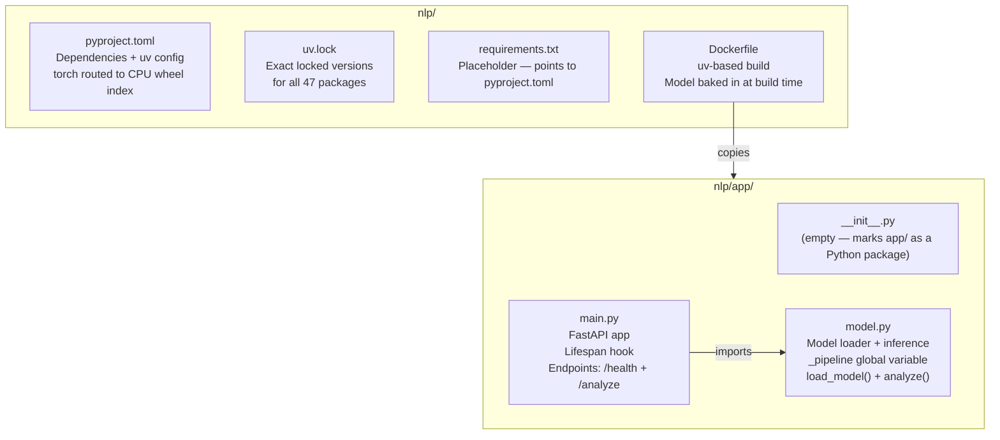
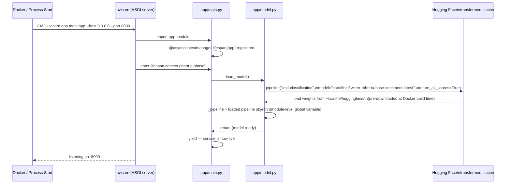
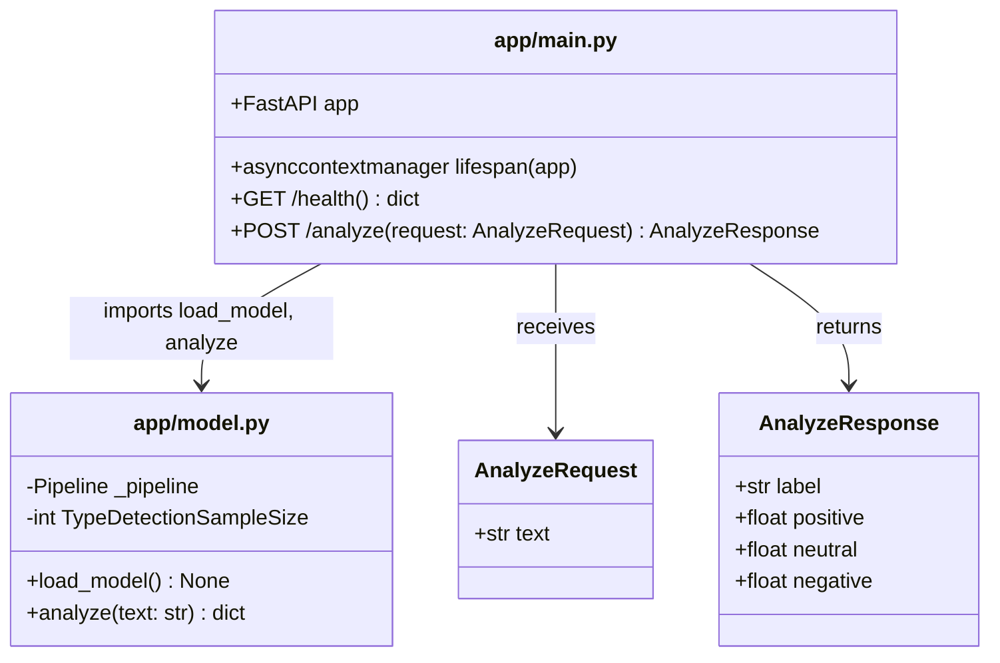
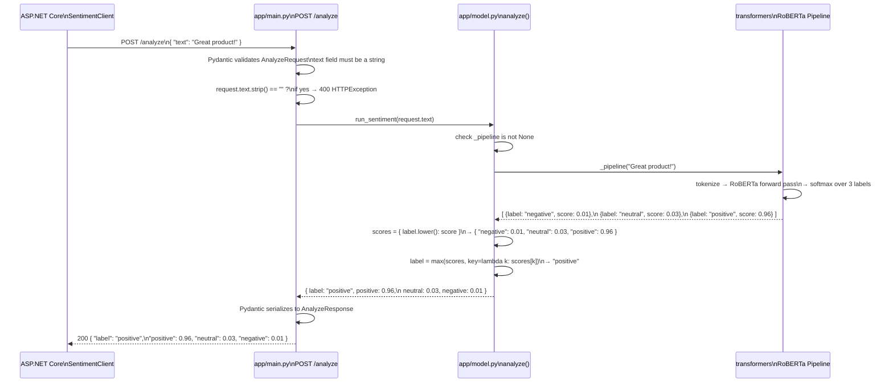
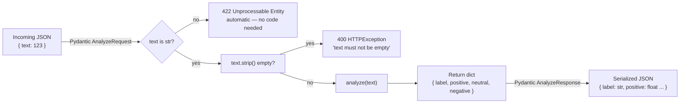
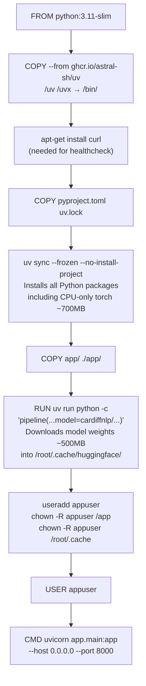
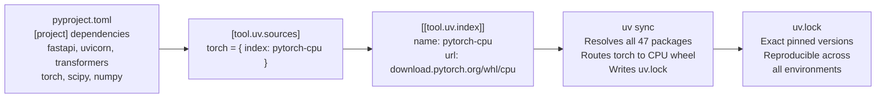
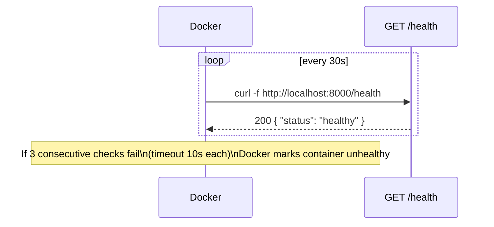

# How It All Connects — Python NLP Service Architecture

This document covers the Python FastAPI sentiment analysis service in `nlp/`.
Read it alongside the source files — each section points to the exact file and
what to look for.

---

## 1. Project Structure

---

## 2. Application Lifecycle

The model is loaded **once at startup**, not per request. This is the most
important design decision in the service — the model is 700MB and takes 2–5
seconds to load.

**Why a module-level global?** `_pipeline` is set at the module level in
`model.py`. Any code that calls `analyze()` — regardless of which request it
belongs to — uses the same pipeline object. Python's GIL means this is safe
for the single-threaded async FastAPI model without locks.

---

## 3. Module + Function Diagram

---

## 4. Request Lifecycle — POST /analyze

---

## 5. Model Output — Why `return_all_scores=True`

The `transformers` pipeline has two modes:

| Mode | What it returns | Used for |
|---|---|---|
| Default (`return_all_scores=False`) | `[{ label: "positive", score: 0.96 }]` | Only the winning label + its score |
| `return_all_scores=True` | `[{ label: "negative", score: 0.01 }, { label: "neutral", score: 0.03 }, { label: "positive", score: 0.96 }]` | All three labels + all three scores |

This project uses `return_all_scores=True` because the database stores all
three scores (`PositiveScore`, `NeutralScore`, `NegativeScore`) in `SentimentResult`.
Storing all three lets the dashboard show full sentiment distributions, not
just the winning label.

---

## 6. Label Mapping — cardiffnlp Model

The model `cardiffnlp/twitter-roberta-base-sentiment-latest` returns these labels:

| Model label | Normalized (`.lower()`) | Stored as |
|---|---|---|
| `negative` | `negative` | `SentimentResult.Label = "negative"` |
| `neutral` | `neutral` | `SentimentResult.Label = "neutral"` |
| `positive` | `positive` | `SentimentResult.Label = "positive"` |

The `.lower()` call in `model.py` is defensive — if the model ever returns
uppercase labels (`NEGATIVE`, `POSITIVE`) from a different checkpoint, the
normalization prevents a mismatch with the values the C# code expects.

---

## 7. Pydantic Request/Response Validation

FastAPI uses **Pydantic** models to automatically validate incoming JSON bodies
and serialize outgoing responses.

If the ASP.NET Core API ever sends malformed JSON (e.g. a missing `text` field),
Pydantic returns a `422` response automatically. The C# `SentimentClient` treats
any non-success status as `null` and skips that cell — the upload continues.

---

## 8. Docker Build — Model Baking

**Why bake the model at build time?**

| Approach | Build time | Startup time | Network dependency at runtime |
|---|---|---|---|
| Download at container start | Fast | 30–60s per cold start | Yes — fails if no internet |
| Bake into image (used here) | Slow (one time) | ~2s | No |

The `chown -R appuser /root/.cache` step is critical — the model weights are
cached in root's home directory during build. Transferring ownership ensures
the non-root `appuser` can read them at runtime.

---

## 9. uv Dependency Management

The `[tool.uv.sources]` override is what makes `torch` come from the CPU-only
wheel index. Without it, `uv` would pull the default PyPI `torch` package which
includes CUDA support — a 3.5GB download that we don't need since the model runs
fast enough on CPU for batch survey processing.

---

## 10. Health Check

The `GET /health` endpoint in `main.py` returns immediately without calling
the model or touching any state. It exists purely to confirm the web server
is up and the port is reachable. The ASP.NET Core `SentimentClient` does not
currently call `/health` before sending requests — this is a future improvement
for the Step 6 async worker.
