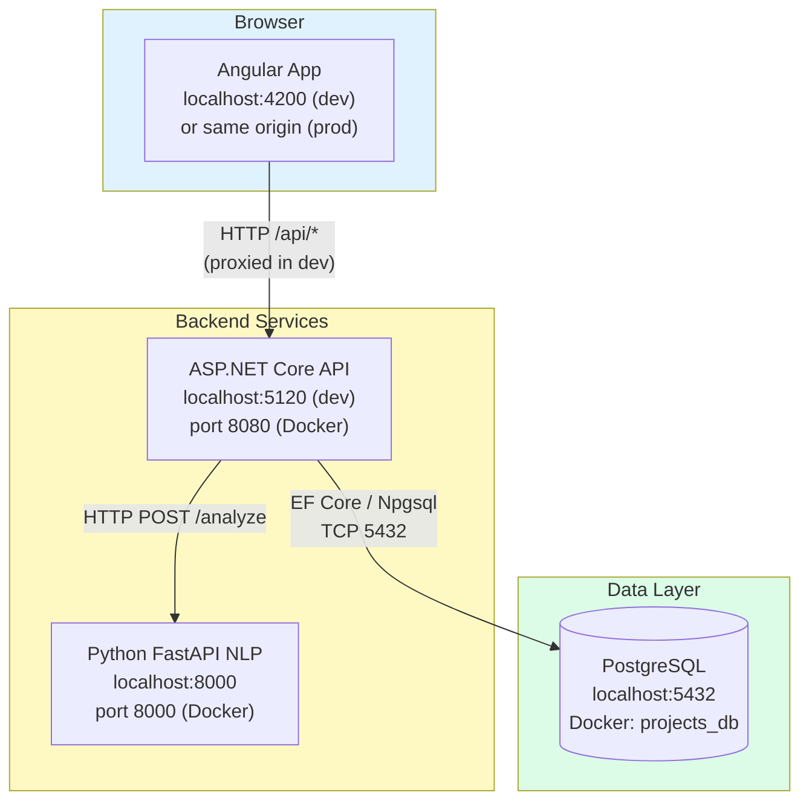
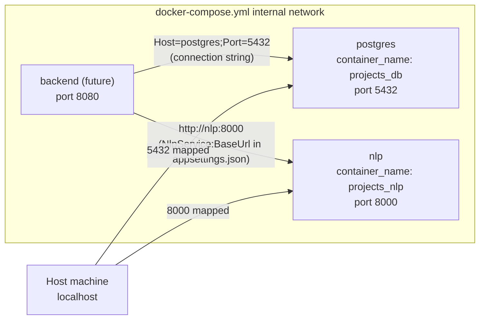
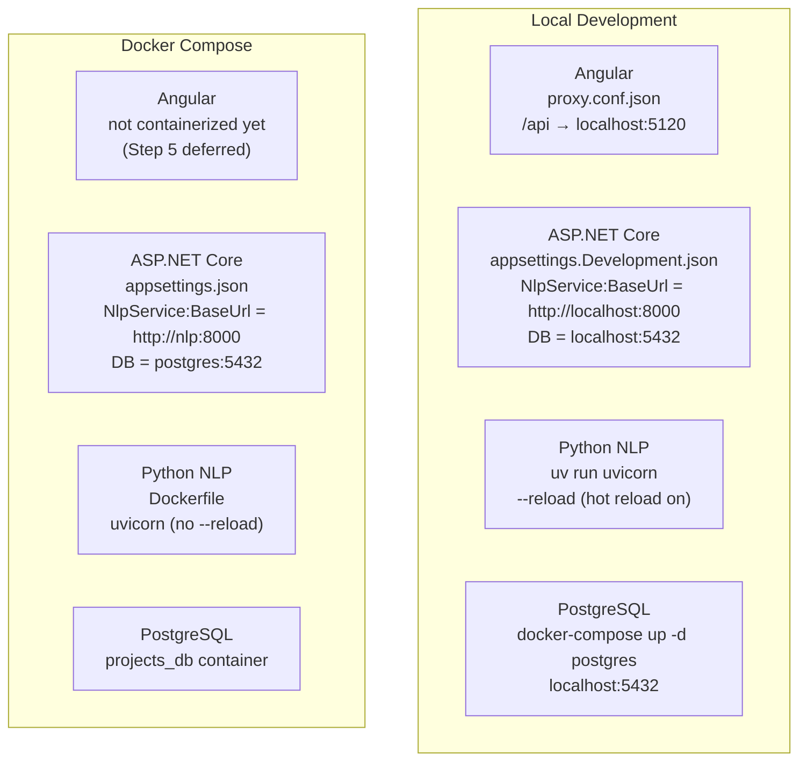
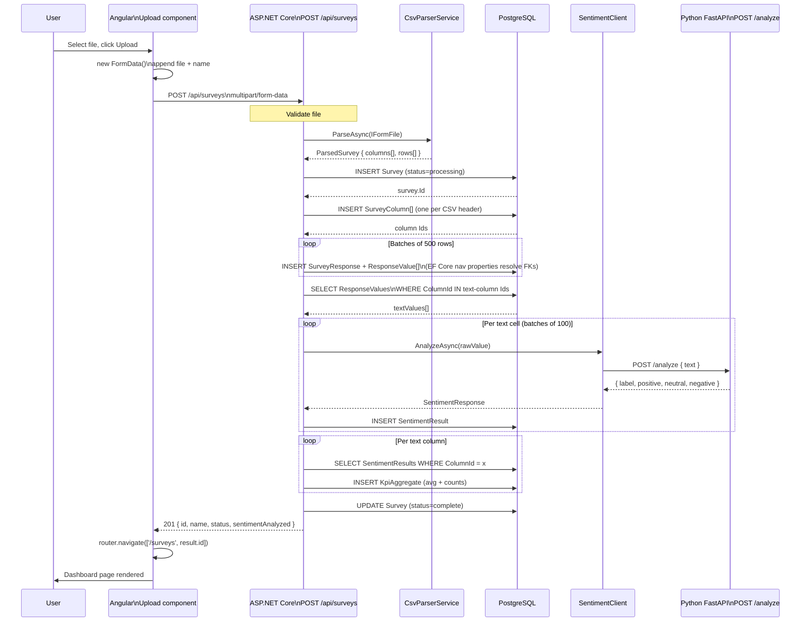
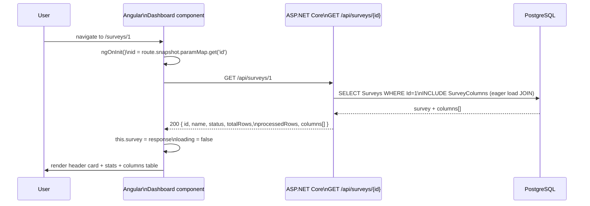
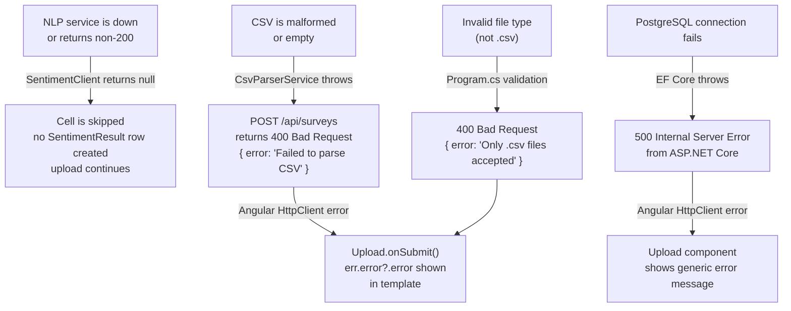
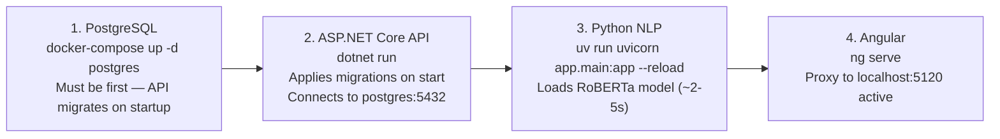

# How It All Connects — Full Stack Architecture

This document shows how Angular, ASP.NET Core, Python NLP, and PostgreSQL
connect to each other. It is the zoom-out view — read the layer-specific
docs (`_10`, `_11`, `_12`) for internal details of each service.

---

## 1. System Topology

All four services, their ports, and which processes communicate with which.

---

## 2. Port Reference

| Service | Local dev port | Docker port | How to start |
|---|---|---|---|
| Angular | 4200 | N/A (static files in prod) | `ng serve` |
| ASP.NET Core API | 5120 | 8080 | `dotnet run` |
| Python NLP | 8000 | 8000 | `uv run uvicorn app.main:app --reload` |
| PostgreSQL | 5432 | 5432 | `docker-compose up -d postgres` |

---

## 3. Docker Network

In Docker, services communicate by **service name** (not localhost). Docker
Compose creates an internal DNS so every container can reach every other
container by name.

**`"nlp"` in `http://nlp:8000`** is resolved by Docker's internal DNS to the
NLP container's IP. This is why `appsettings.json` (used in Docker/Production)
has `http://nlp:8000` and `appsettings.Development.json` (used locally) has
`http://localhost:8000`.

---

## 4. Configuration Per Environment

How each service knows where to find the others:

---

## 5. Full Request — CSV Upload (End to End)

The most complex flow in the system. Traces a user action from browser click
to database row.

---

## 6. Full Request — View Survey Dashboard (End to End)

**EF Core eager loading:** `db.Surveys.Include(s => s.Columns)` generates a
single SQL query with a JOIN to `SurveyColumns`. Without `.Include()`, the
`Columns` navigation property would be `null` (lazy loading is disabled by
default in EF Core).

---

## 7. Service Boundaries and Contracts

Each service has a well-defined HTTP contract. These are the exact shapes
crossing each boundary.

### Angular → ASP.NET Core

| Direction | Method + Path | Request shape | Response shape |
|---|---|---|---|
| List surveys | `GET /api/surveys` | — | `Survey[]` |
| Get survey detail | `GET /api/surveys/{id}` | — | `SurveyDetail` (with `columns[]`) |
| Upload CSV | `POST /api/surveys` | `multipart/form-data` file + optional name | `UploadResult` (201) |

### ASP.NET Core → Python NLP

| Direction | Method + Path | Request shape | Response shape |
|---|---|---|---|
| Analyze text | `POST /analyze` | `{ "text": "..." }` | `{ "label": "positive\|neutral\|negative", "positive": float, "neutral": float, "negative": float }` |
| Health check | `GET /health` | — | `{ "status": "healthy" }` |

### ASP.NET Core → PostgreSQL (EF Core)

Not HTTP — EF Core uses Npgsql to send SQL over TCP port 5432. The queries
are generated from LINQ expressions in `Program.cs`:

| Operation | EF Core call | Generated SQL |
|---|---|---|
| Save survey | `db.Surveys.Add(survey)` + `SaveChangesAsync()` | `INSERT INTO "Surveys" ...` |
| Load survey + columns | `db.Surveys.Include(s => s.Columns).FirstOrDefaultAsync(s => s.Id == id)` | `SELECT ... FROM "Surveys" JOIN "SurveyColumns" ...` |
| Load text values | `db.ResponseValues.Where(rv => ids.Contains(rv.ColumnId))` | `SELECT ... FROM "ResponseValues" WHERE "ColumnId" = ANY(...)` |
| Load sentiment by column | `db.SentimentResults.Where(sr => sr.ResponseValue.ColumnId == id)` | `SELECT ... FROM "SentimentResults" JOIN "ResponseValues" ...` |

---

## 8. Error Propagation Across Layers

What happens when something goes wrong at each boundary:

---

## 9. Local Full-Stack Startup Order

Services must start in this order because of dependencies:

The API and NLP service are independent of each other at startup — the API
only calls NLP when a CSV is uploaded, not on startup. However, if NLP is not
running when a CSV is uploaded, all cells will be skipped silently (null returns
from `SentimentClient`). KpiAggregates will be empty for that upload.
