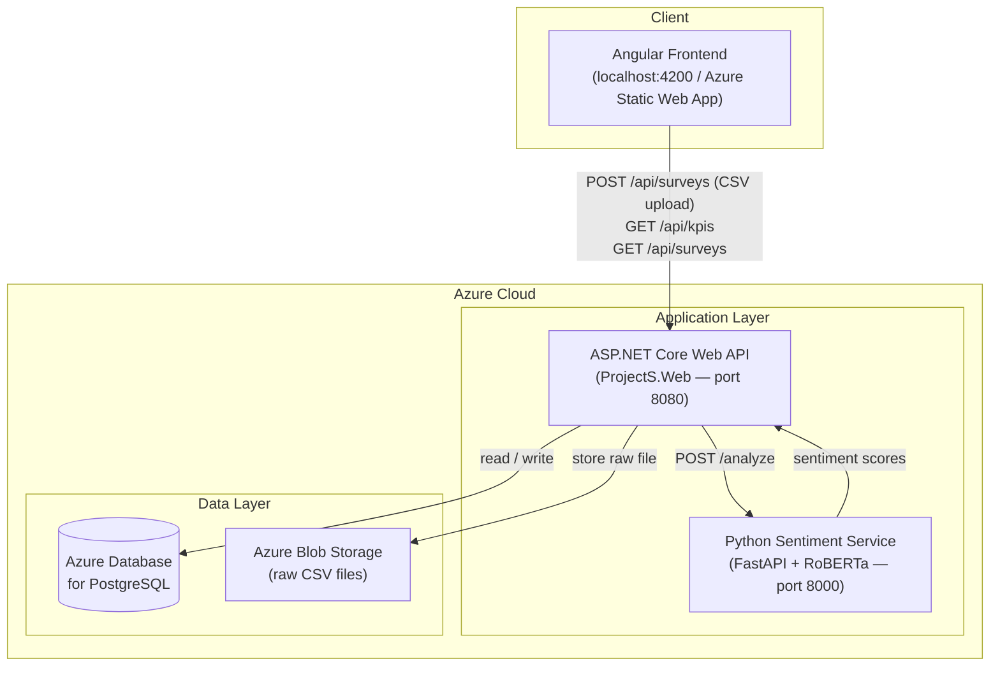
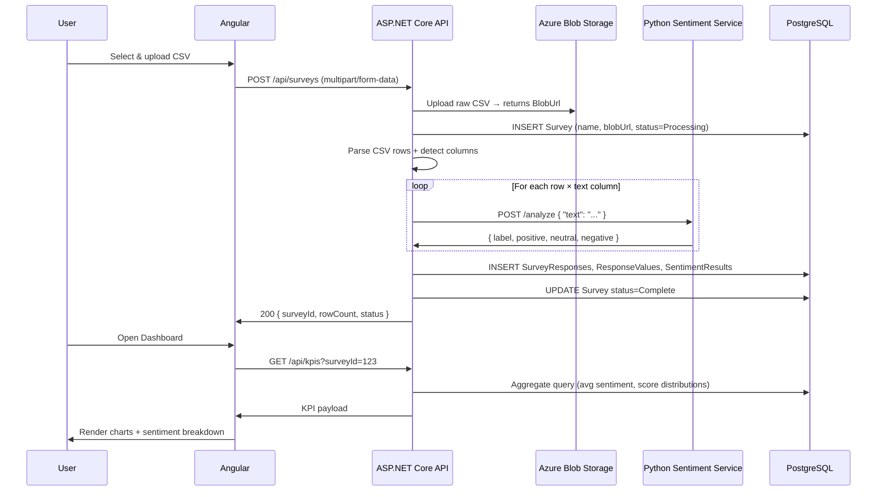
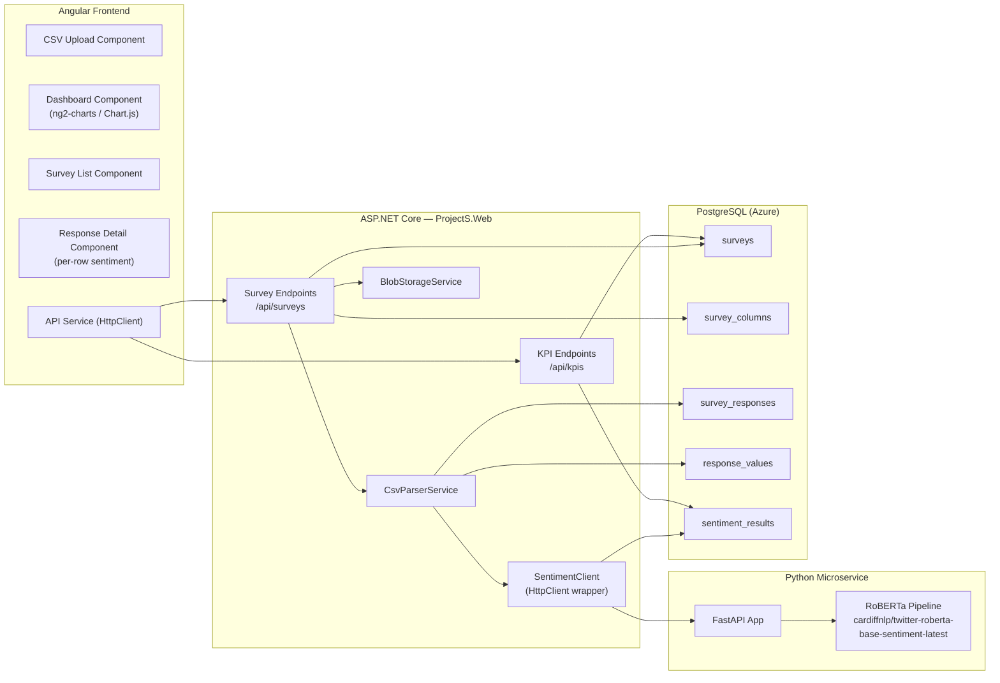
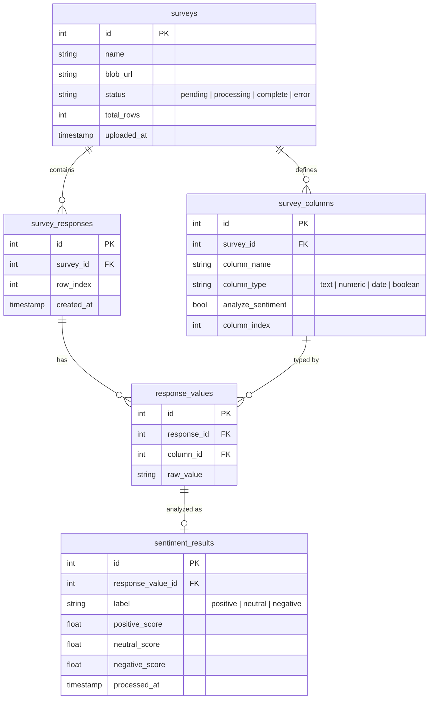
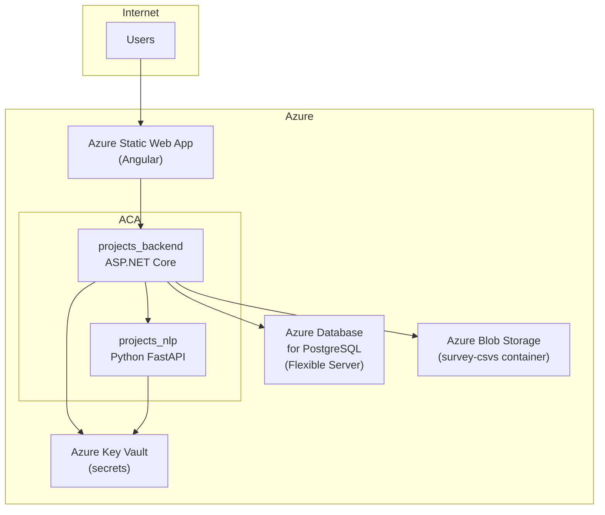

# System Architecture — KPI Survey Dashboard

## Overview

Users upload CSV survey data through an Angular frontend. The ASP.NET Core API parses the data, farms out free-text responses to a Python sentiment analysis microservice (RoBERTa), and persists everything to Azure PostgreSQL. The frontend renders KPI dashboards and sentiment breakdowns from the stored results.

---

## 1. High-Level System Diagram



---

## 2. CSV Upload & Processing Flow



---

## 3. Service & Component Breakdown



---

## 4. Database Schema



---

## 5. Docker Compose (Target State)

```
┌─────────────────────────────────────────────────────────────┐
│                     docker-compose.yml                       │
│                                                             │
│  postgres      → port 5432  (Azure DB in prod)             │
│  backend       → port 5000→8080  (ASP.NET Core)            │
│  nlp           → port 8000→8000  (Python FastAPI)          │
│  frontend      → port 4200→80    (Angular, nginx)          │
└─────────────────────────────────────────────────────────────┘
```

Services communicate over an internal Docker network. In production, `postgres` is replaced by Azure Database for PostgreSQL (Flexible Server), with the connection string injected via Azure Key Vault / environment variables.

---

## 6. Azure Production Topology



---

## 7. Build-Out Phases

### Phase 1 — Backend Foundation
- [ ] Replace Nuxt frontend folder with Angular project (`ng new frontend`)
- [ ] Add `surveys`, `survey_columns`, `survey_responses`, `response_values`, `sentiment_results` EF Core entities + migration
- [ ] `POST /api/surveys` — accept multipart CSV, upload to Blob, parse, persist rows (no sentiment yet)
- [ ] `GET /api/surveys` and `GET /api/surveys/{id}/responses`

### Phase 2 — Sentiment Microservice
- [ ] Create `nlp/` directory at project root
- [ ] FastAPI app with `POST /analyze` using `cardiffnlp/twitter-roberta-base-sentiment-latest`
- [ ] Add `nlp` service to `docker-compose.yml`
- [ ] Wire `SentimentClient` in ASP.NET Core → call NLP service during CSV processing

### Phase 3 — KPI Aggregation
- [ ] `GET /api/kpis?surveyId=` — returns sentiment distribution, score averages per column, total responses
- [ ] Angular: CSV upload flow → progress indicator → redirect to dashboard
- [ ] Angular: Dashboard with Chart.js (donut for sentiment split, bar/line for scores over time)

### Phase 4 — Azure Deployment
- [ ] Provision Azure PostgreSQL Flexible Server + Blob Storage + Key Vault
- [ ] Dockerfiles for `backend` and `nlp` services
- [ ] Azure Container Apps deployment (or App Service)
- [ ] Angular → Azure Static Web Apps
- [ ] GitHub Actions CI/CD pipeline

---

## Key Technical Decisions

| Decision | Choice | Reason |
|---|---|---|
| Sentiment model | `cardiffnlp/twitter-roberta-base-sentiment-latest` | Pretrained, open-source, good general sentiment |
| NLP service framework | FastAPI | Async, lightweight, auto OpenAPI docs |
| CSV processing | Synchronous in request (Phase 1), consider background job if files are large | Simple to start; can add Azure Service Bus queue later |
| Frontend | Angular (replacing Nuxt) | User requirement |
| File storage | Azure Blob Storage | Keep DB lean; CSVs can be large |
| Secrets | Azure Key Vault (prod) / `.env` (local) | Security |
