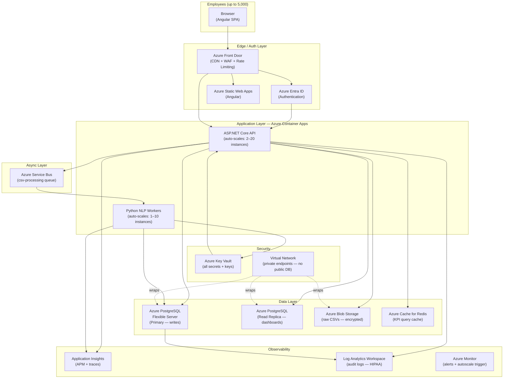
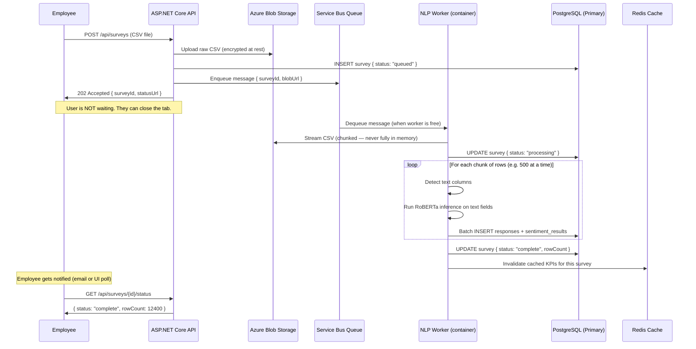
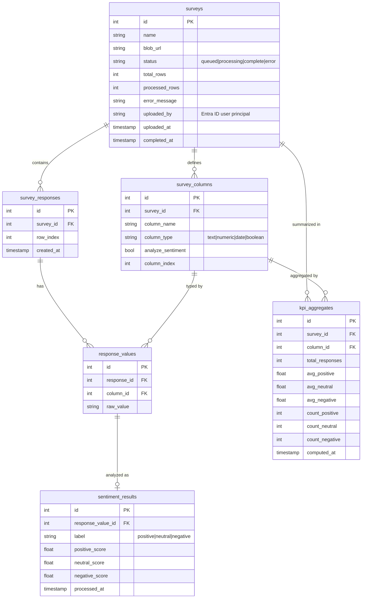

# Scalability & Production Design — KPI Survey Dashboard

**Audience:** Engineers, stakeholders, architects
**Status:** Design proposal — intern project, production-intent

---

## Stated Assumptions

These are explicitly called out so stakeholders can correct them.

| Assumption | Value Used |
|---|---|
| Total employees (users) | ~5,000 |
| Peak concurrent active users | ~500 |
| CSV size per upload | Up to 50MB, up to 100,000 rows |
| Peak simultaneous uploads | ~50 (post-event, end-of-quarter bursts) |
| CSV format | Variable columns per event — dynamic schema detection required |
| Data sensitivity | HIPAA — customer feedback may contain PHI |
| Azure tenant | Single organization, greenfield subscription |
| Authentication | Azure Entra ID (employees have existing accounts) |
| Ownership | Small team (1–3 engineers) initially |
| Deployment target | Azure (all services) |

---

## 1. Core Scaling Challenges

These are the real engineering problems stakeholders are asking about.

### Challenge 1 — Burst Upload Traffic
Many employees submit CSVs simultaneously after the same event. A synchronous
"upload → wait → results" model will time out and overwhelm the API.

**Answer:** Async job queue. Upload returns immediately; processing happens in the background.

### Challenge 2 — Variable CSV Formats
Each event produces different column names and structures. The system cannot assume
a fixed schema.

**Answer:** Dynamic column detection on upload. `survey_columns` table stores the
detected schema per file. No hardcoded column expectations in the API.

### Challenge 3 — NLP Inference at Scale
RoBERTa inference is computationally expensive (~100–500ms per text field). A CSV
with 10,000 rows and 3 text columns = 30,000 model calls. This cannot happen inside
an HTTP request.

**Answer:** NLP processing happens as a background worker consuming from a queue.
Scale the NLP service horizontally based on queue depth.

### Challenge 4 — Concurrent Reads (Dashboard)
Thousands of employees querying dashboards simultaneously will contend with writes
from ongoing CSV processing.

**Answer:** Separate the read path from the write path. Pre-aggregate KPI data.
Use a read replica for dashboard queries.

### Challenge 5 — HIPAA Compliance
Customer feedback may contain PHI. Mishandling this creates legal liability.

**Answer:** Dedicated compliance controls at every layer — see Section 5.

---

## 2. Target Production Architecture



---

## 3. Async CSV Processing Flow (Solves Challenges 1 + 3)

This is the most important architectural decision. Nothing blocks the user.



**Key details:**
- `202 Accepted` is the correct HTTP status for async work — not `200`
- CSV is streamed in chunks so a 50MB file never fully loads into memory
- NLP worker and API are **decoupled** — if the NLP service is slow, uploads are unaffected
- Redis cache is invalidated when a survey finishes so dashboards always show fresh data

---

## 4. Scaling Strategy Per Component

### API (ASP.NET Core on Azure Container Apps)

| Metric | Min instances | Max instances | Scale trigger |
|---|---|---|---|
| Normal load | 2 | 20 | HTTP request count > 100/sec per instance |
| Off-hours | 1 | 5 | Scale in after 10 min low traffic |

- Stateless by design — any instance handles any request
- Database connection pooling via **PgBouncer** (built into Flexible Server)
- Rate limiting at Azure Front Door (e.g. 100 req/min per user)

### NLP Workers (Python FastAPI on Azure Container Apps)

| Metric | Min instances | Max instances | Scale trigger |
|---|---|---|---|
| Normal | 1 | 10 | Service Bus queue depth > 5 messages |
| Idle | 0 | — | Scale to zero when queue empty (cost saving) |

- Workers pull from Service Bus — no work, no cost
- Each worker processes one CSV at a time, fully async
- If a worker crashes mid-processing, Service Bus re-delivers the message (dead-letter queue catches repeated failures)

### PostgreSQL (Flexible Server)

| Concern | Solution |
|---|---|
| Concurrent writes (CSV imports) | Connection pool via PgBouncer, batch INSERTs |
| Concurrent reads (dashboards) | Read replica — all GET /api/kpis → read replica |
| Large table scans | Partition `survey_responses` by `survey_id` and `created_at` |
| Slow dashboard aggregations | Materialized view for KPI aggregates, refreshed on survey complete |
| Index design | Indexes on `survey_id`, `created_at`, `status`, `label` |

### Blob Storage

- CSVs stored under `/surveys/{tenantId}/{surveyId}/raw.csv`
- Lifecycle policy: move to Cool tier after 90 days, Archive after 1 year
- Soft delete enabled (30-day recovery window)

---

## 5. HIPAA Compliance Controls

HIPAA requires protecting PHI at rest, in transit, and in access. Customer feedback
CSV files are treated as potentially containing PHI.

### Encryption

| Layer | Control |
|---|---|
| Data in transit | TLS 1.2+ enforced at Front Door and between all services |
| Data at rest (Blob) | Azure Storage Service Encryption (AES-256), customer-managed key via Key Vault |
| Data at rest (DB) | Azure PostgreSQL transparent data encryption (AES-256) |
| Secrets | All connection strings, API keys stored in Azure Key Vault — never in code or env files |

### Access Control

| Control | Implementation |
|---|---|
| Authentication | Azure Entra ID (SSO — employees use their work accounts) |
| Authorization | Role-based: Viewer (read dashboards), Analyst (upload CSVs), Admin |
| Database access | Managed Identity — API authenticates to DB without passwords |
| Blob access | Managed Identity — no shared access keys in code |
| Least privilege | Each service has only the permissions it needs, nothing more |

### Audit Logging (HIPAA requires this)

Every access to PHI must be logged.

| Event | Logged to |
|---|---|
| CSV upload (who, when, file name) | Log Analytics Workspace |
| Survey data read (who, which survey) | Log Analytics Workspace |
| Authentication events | Entra ID sign-in logs |
| Database queries touching PHI | PostgreSQL audit extension (pgaudit) |
| Failed access attempts | Azure Monitor alerts → notify on-call |

**Important:** Application Insights (APM) must be configured to **scrub PII** from
traces and logs. Survey response text must never appear in trace data.

### Compliance Checklist

- [ ] Sign Microsoft Azure HIPAA Business Associate Agreement (BAA)
- [ ] Enable pgaudit on PostgreSQL Flexible Server
- [ ] Configure Key Vault with HSM-backed keys
- [ ] Enable Defender for Cloud (vulnerability scanning)
- [ ] Private endpoints for PostgreSQL and Blob (no public internet access)
- [ ] Set data retention policy (HIPAA: 6 years minimum)
- [ ] Document data flows (required for HIPAA risk assessment)
- [ ] Enable soft delete on Blob Storage

---

## 6. Database Design for Scale

Changes from the initial schema to handle large data volumes:



**`kpi_aggregates` table** is the key addition. Instead of running expensive `AVG` and
`COUNT` queries over millions of rows every time a user opens a dashboard, the NLP
worker pre-computes these when a survey finishes. Dashboard reads from this table —
fast, flat, indexed.

---

## 7. What Changes in the Current Codebase

The current implementation is synchronous (upload → process → respond). These are
the concrete changes needed for production scale:

| Current | Needs to become |
|---|---|
| `POST /api/surveys` processes CSV inline | Enqueue a Service Bus message, return `202` |
| NLP called inside the API request | Separate NLP Worker container consuming from queue |
| Direct DB connection string in appsettings | Managed Identity + Key Vault reference |
| No authentication | Azure Entra ID middleware (`AddMicrosoftIdentityWebApi`) |
| Single PostgreSQL | Primary (writes) + Read Replica (dashboard reads) |
| No caching | Redis cache on `/api/kpis` responses |
| No audit logging | Structured logging to Log Analytics with user context |
| docker-compose only | Azure Container Apps + GitHub Actions deploy pipeline |

---

## 8. GitHub Actions — Production Deploy Pipeline

```
On: push to main

Jobs:
┌──────────────────────────────────────────────┐
│  test          (all unit + integration tests) │
├──────────────────────────────────────────────┤
│  build         (docker build all images)      │
│                push to Azure Container Reg.   │
├──────────────────────────────────────────────┤
│  deploy-staging                               │
│    - Update Container Apps (staging slot)     │
│    - Run integration tests against staging    │
│    - Run smoke tests (health endpoints)       │
├──────────────────────────────────────────────┤
│  deploy-production  (manual approval gate)    │
│    - Promote staging → production             │
│    - Zero-downtime rolling update             │
└──────────────────────────────────────────────┘
```

The manual approval gate means a human confirms before anything hits production.
This is standard in regulated (HIPAA) environments.

---

## 9. Cost Estimate (Rough Tiers)

Assumed Azure region: East US. All figures are approximate.

| Service | Tier | Est. Monthly Cost |
|---|---|---|
| Container Apps (API, 2–20 instances) | Consumption | $50–$300 |
| Container Apps (NLP workers, 0–10) | Consumption | $0–$200 (scales to zero) |
| PostgreSQL Flexible Server | General Purpose, 2 vCores | ~$120 |
| PostgreSQL Read Replica | Same tier | ~$120 |
| Azure Blob Storage (1TB) | LRS, Cool tier for old files | ~$20 |
| Azure Service Bus | Standard | ~$10 |
| Azure Cache for Redis | C1 Basic | ~$55 |
| Azure Front Door | Standard | ~$35 |
| Log Analytics Workspace | Pay-per-GB | ~$30 |
| Application Insights | Pay-per-GB | ~$20 |
| Key Vault | Standard | ~$5 |
| **Estimated total** | | **~$665–$915/mo** |

Scale-to-zero on NLP workers is a significant cost lever — the most expensive
compute only runs when there is actual work to do.

---

## 10. Open Questions for Stakeholders

These need answers before implementation begins:

1. **Data retention** — How long must survey data be kept? HIPAA minimum is 6 years.
2. **Who owns the HIPAA BAA?** — Must be signed with Microsoft before any PHI touches Azure.
3. **Role definitions** — Who can upload CSVs vs. only view dashboards? Is this per-department?
4. **PII in CSV files** — Are respondent names/emails included in the CSV? If so, they need to be masked or excluded before storage.
5. **Notification mechanism** — When async processing completes, how should employees be notified? Email, in-app, both?
6. **Multi-tenancy** — Is this one organization only, or will multiple companies eventually use it? This changes the data isolation model significantly.
